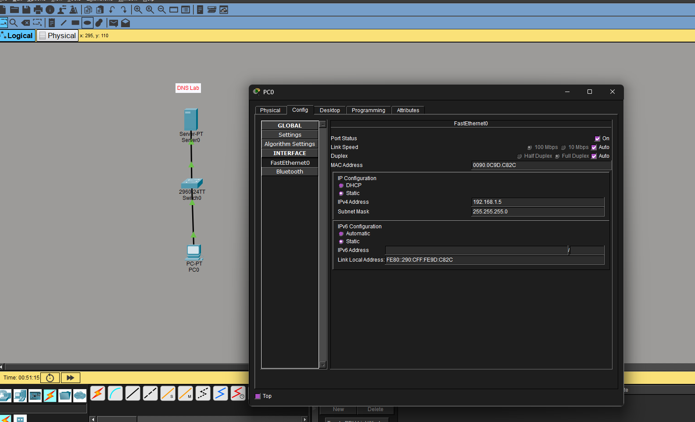

# Overview

**DNS(Domain Name System)**
Hierarchical and distributed system that translates names into IP addresses. Critical component of internet infrastructure
Port 53 TCP/UDP


#  DNS Lab: Need for Configuration
- Configure Router Hostnames and Static Addresses
- Configure DNS entry on DNS Server
- Test Connection


Note: `#` in the code blocks are my own comments and will not appear in network device CLI
# Task 1: Configure Router Hostnames
Combine PC(s), Server and a Switch via Straight-Through Copper Cables.

**Configuring PC0**
Configure the Following:
- IP Address: `192.168.1.5`
- Subnet Mask: Accept Default Autofill
- DNS Server: 192.168.1.1

```cisco
C:\> ipconfig
FastEthernet0 Connection:(default port)
Connection-specific DNS Suffix..:
Link-local IPv6 Address.........: FE80::290:CFF:FE9D:C82C
IPv6 Address....................: ::
IPv4 Address....................: 192.168.1.5
Subnet Mask.....................: 255.255.255.0
Default Gateway.................: ::
0.0.0.0

Bluetooth Connection:
Connection-specific DNS Suffix..:
Link-local IPv6 Address.........: ::
IPv6 Address....................: ::
IPv4 Address....................: 0.0.0.0
Subnet Mask.....................: 0.0.0.0
Default Gateway.................: ::0.0.0.0
```



**Configuring Server 0**
```cisco
C:\>ipconfig /all
FastEthernet0 Connection:(default port)

Connection-specific DNS Suffix..:
Physical Address................: 0002.16D2.4726
Link-local IPv6 Address.........: FE80::202:16FF:FED2:4726
IPv6 Address....................: ::
IPv4 Address....................: 192.168.1.1
Subnet Mask.....................: 255.255.255.0
Default Gateway.................: ::0.0.0.0

DHCP Servers....................: 0.0.0.0
DHCPv6 IAID.....................:
DHCPv6 Client DUID..............: 00-01-00-01-CD-6D-5A-B2-00-02-16-D2-47-26
DNS Servers.....................: ::0.0.0.0
```


Check connectivity to DNS server with `ping`
`ping 192.168.1.1`

You can check the `arp -a`
```cisco
C:\>arp -a

Internet Address Physical Address Type
192.168.1.1 0002.16d2.4726 dynamic
```

# Task 2: Configuring DNS Entry
**Testing DNS Resolution**
Try accessing `www.testpage.com` in PC0 web browser.
Notice nothing happens as we have not created a DNS entry.

**Configuring DNS on Server0**
**Configuring Server0**
Set DNS Service  to `On`
Configure the Following:
- Name: `www.testpage.com`
- IP Address: `192.168.1.1`
- Type: `A Record`
`Add` DNS entry into Records

Remember an `A Record` translates Domain name to IPV4 record


# Task 3: Checking Configuration
**Checking with ipconfig /all**
```cisco
C:\>ipconfig /all

FastEthernet0 Connection:(default port)

Connection-specific DNS Suffix..:
Physical Address................: 0090.0C9D.C82C
Link-local IPv6 Address.........: FE80::290:CFF:FE9D:C82C
IPv6 Address....................: ::
IPv4 Address....................: 192.168.1.5
Subnet Mask.....................: 255.255.255.0
Default Gateway.................: ::
0.0.0.0

DHCP Servers....................: 0.0.0.0
DHCPv6 IAID.....................:
DHCPv6 Client DUID..............: 00-01-00-01-A0-71-E6-65-00-90-0C-9D-C8-2C
DNS Servers.....................: ::192.168.1.1

  

Bluetooth Connection:
Connection-specific DNS Suffix..:
Physical Address................: 000D.BDDB.412A
Link-local IPv6 Address.........: ::
IPv6 Address....................: ::
IPv4 Address....................: 0.0.0.0
Subnet Mask.....................: 0.0.0.0
Default Gateway.................: ::0.0.0.0

DHCP Servers....................: 0.0.0.0
DHCPv6 IAID.....................:
DHCPv6 Client DUID..............: 00-01-00-01-A0-71-E6-65-00-90-0C-9D-C8-2C
DNS Servers.....................: ::192.168.1.1
```

**Checking with nslookup**
```cisco

C:\>nslookup www.testpage.com

Server: [192.168.1.1]
Address:  192.168.1.1

Non-authoritative answer:
Name:   www.testpage.com
Address:   192.168.1.1
           
C:\>nslookup alias.testpage.com

Server: [192.168.1.1]
Address:  192.168.1.1

Non-authoritative answer:
Name:   www.testpage.com
Address:   192.168.1.1
           
Aliases:   www.testpage.com
```
# Final Config
Refer to Above images

# Common Commands
`nslookup
The _nslookup_ command is a network administration tool used to query the Domain Name System (DNS) to obtain domain name or IP address mapping information. It is commonly used to diagnose DNS infrastructure issues and verify DNS record

`ipconfig /all`
The ipconfig command is used on Microsoft operating systems to display the IP address configuration.
The ipconfig command alone will display basic IP configuration information, such as IP address, subnet mask, and default gateway.

`netsh interface ip set address "Ethernet" dhcp`
Set IP address and subnet mask via DHCP

`netsh interface ip set dns "Ethernet" static 192.168.1.1`
Set the DNS server manually
# Resources
[101Labs-Networking/DNS-Lab2 at main · polucio/101Labs-Networking](https://github.com/polucio/101Labs-Networking/tree/main/DNS-Lab2)

[What’s My DNS Server – How to Find DNS Server in Windows Command Line](https://www.configserverfirewall.com/windows-10/find-dns-server/)
# References
Browning, Paul. _101 Labs - CompTIA Network+: Hands-on Practical Labs for the N10-008 Exam._
