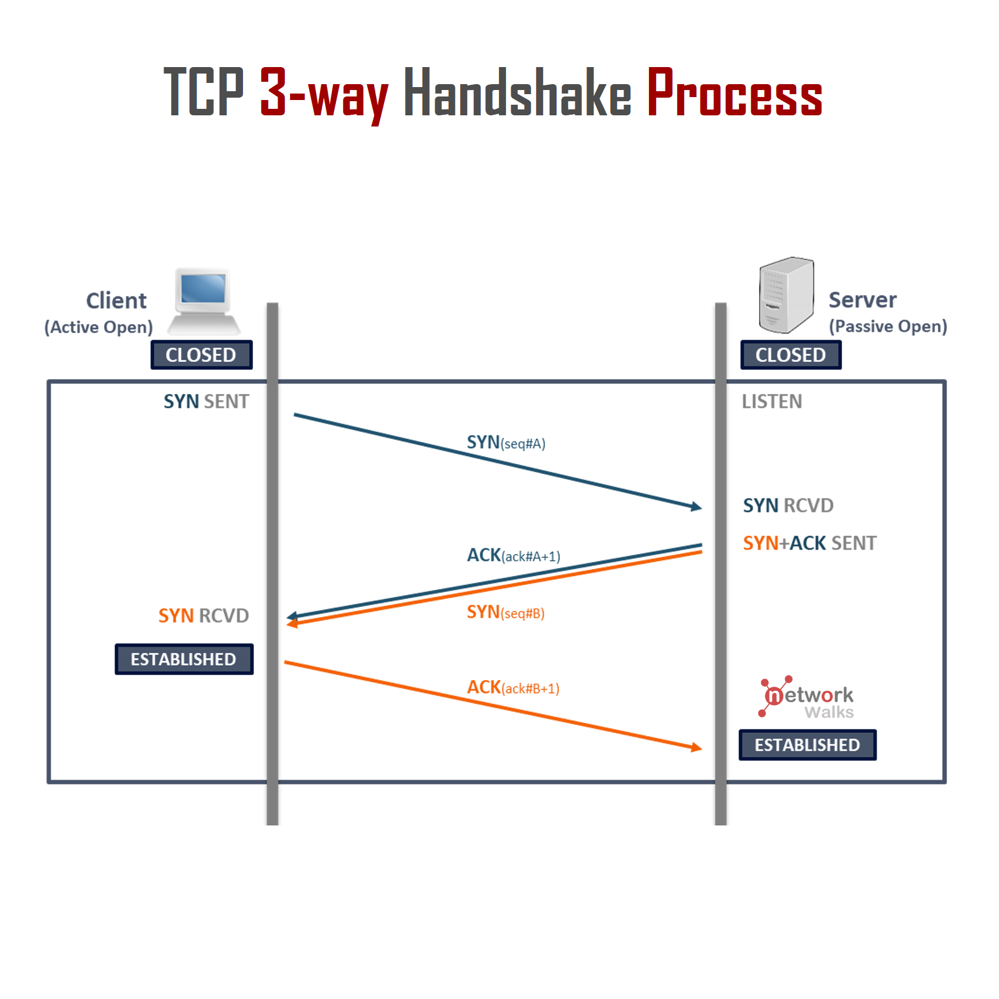
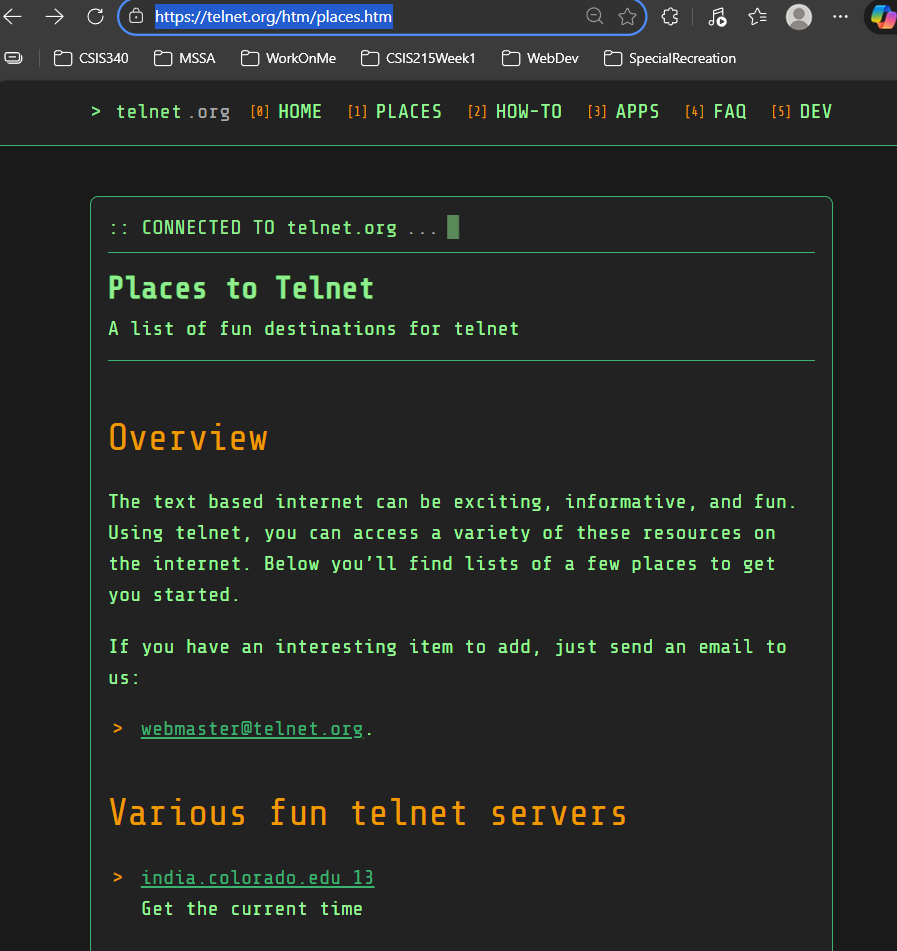
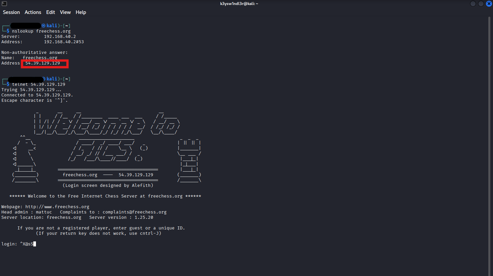
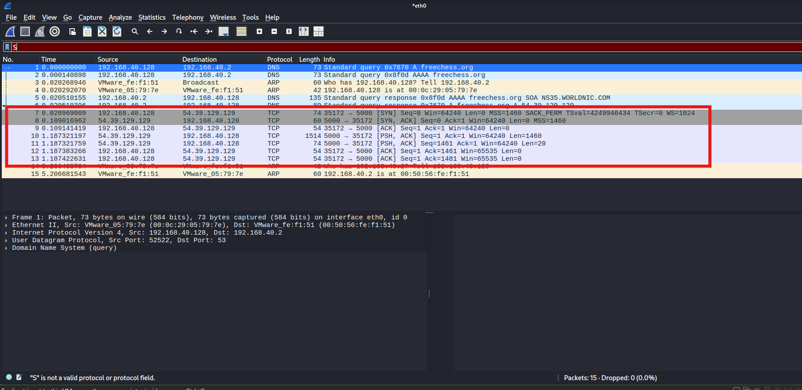
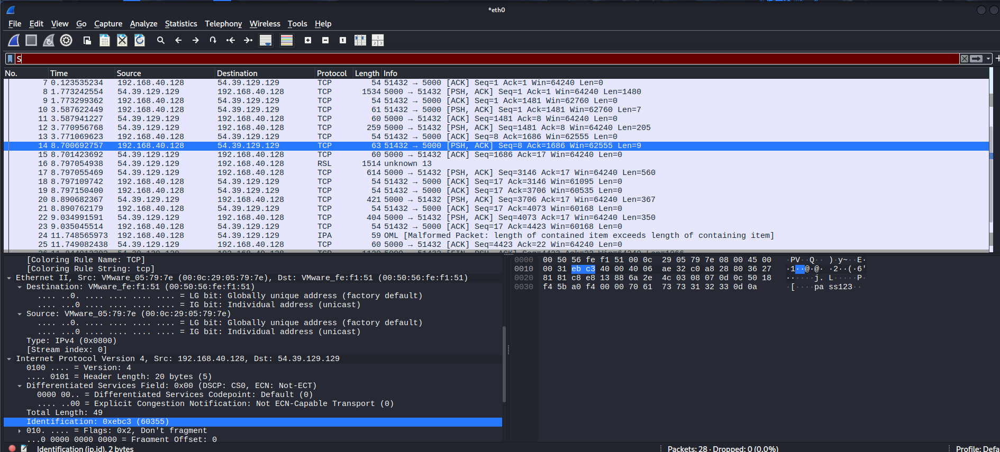

# Overview
**Transmission Control Protocol (TCP)** 
is a connection-oriented protocol for communications that helps in the exchange of messages between different devices over a network. It is one of the main protocols of the [TCP/IP](https://www.geeksforgeeks.org/computer-networks/tcp-ip-model/) suite. In [OSI](https://www.geeksforgeeks.org/computer-networks/open-systems-interconnection-model-osi/) model, it operates at the [transport layer](https://www.geeksforgeeks.org/computer-networks/transport-layer-in-osi-model/)(Layer 4). It lies between the [Application](https://www.geeksforgeeks.org/computer-networks/application-layer-in-osi-model/) and [Network Layer](https://www.geeksforgeeks.org/computer-networks/network-layer-in-osi-model/)s which are used in providing reliable delivery services. The [Internet Protocol](https://www.geeksforgeeks.org/computer-networks/what-is-internet-protocol-ip/) (IP), which establishes the technique for sending data packets between computers, works with TCP.

- TCP establishes a reliable connection between sender and receiver using the three-way handshake (SYN, SYN-ACK, ACK) and it uses a four-step handshake (FIN, ACK, FIN, ACK) to close connections properly.
- It ensures error-free, in-order delivery of data packets.
- It uses acknowledgments (ACKs) to confirm receipt.


This lab will be different in that we will not be utilizing Cisco Packet Tracer. Now we can configure a telnet session between network devices and view its traffic through the simulation tab. But, we cannot analyze the packet beyond its transmission through the network.

A tool we can use to analyze a TCP packet through Telnet more-in-depth is to use **Wireshark**.

**Wireshark**
Wireshark is an open-source packet sniffer/analyzer used to review captured network traffic. It allows in-depth analysis of packets, traffic flows, and metadata can provide detailed info about network behaviors and content.

# Task 1: Lab Setup
The setup for the following lab will established with the following:
- Virtual Machine with a Linux Distribution and Wireshark Installed
- Connection to https://telnet.org

Note: [101Labs-Networking/TCP-Lab6 at main · polucio/101Labs-Networking](https://github.com/polucio/101Labs-Networking/tree/main/TCP-Lab6) contains instructions on how to configure Putty on your host PC for creating telnet sessions:

**Putty**
**PuTTY** is a free and open-source terminal emulator, serial console, and network file transfer application. It supports several network protocols, including **SCP, SSH, Telnet, rlogin**, and raw socket connection. Additionally, PuTTY can connect to a serial port

# Task 2: Visit Telnet.org
**Homepage of Telnet.org**


This website contains active/inactive telnet servers that we can connect to. We can use our `telnet` command to start a session with some of the servers.  Using `telnet` we can directly connect via domain name and port.
```terminal
└─$ telnet freechess.org 5000
Trying 54.39.129.129...
Connected to freechess.org.
Escape character is '^]'.

             _       __     __                             __      
            | |     / /__  / /________  ____ ___  ___     / /_____ 
            | | /| / / _ \/ / ___/ __ \/ __ `__ \/ _ \   / __/ __ \
            | |/ |/ /  __/ / /__/ /_/ / / / / / /  __/  / /_/ /_/ /
            |__/|__/\___/_/\___/\____/_/ /_/ /_/\___/   \__/\____/ 
       ^^__                  _____________________                 _  _  _ 
      /  - \_               / ____/  _/ ____/ ___/   _            | || || |
    <|    __<              / /_   / // /    \__ \   (_)           |_______|
    <|    \               / __/ _/ // /___ ___/ /  _              \__ ___ /
    <|     \             /_/   /___/\____//____/  (_)              |___|_|
    <|______\                                                      |_|___|
     _|____|_        ======================================        |___|_|
    (________)         freechess.org  ----  54.39.129.129         (_______)
    /________\       ======================================       /_______\ 
                       (Login screen designed by Alefith)

   ****** Welcome to the Free Internet Chess Server at freechess.org ******

Webpage: http://www.freechess.org
Head admin : mattuc   Complaints to : complaints@freechess.org
Server location: freechess.org   Server version : 1.25.20

      If you are not a registered player, enter guest or a unique ID.
             (If your return key does not work, use cntrl-J)

login:
```

In the case where we only have the ip address of the server we can connect via IP address as well



**Now End the telnet session but keep the terminal open**
# Task 3: Setting up Wireshark
**Find our target network device for packet capture**
```cisco
$ ip a
1: lo: <LOOPBACK,UP,LOWER_UP> mtu 65536 qdisc noqueue state UNKNOWN group default qlen 1000
    link/loopback 00:00:00:00:00:00 brd 00:00:00:00:00:00
    inet 127.0.0.1/8 scope host lo
       valid_lft forever preferred_lft forever
    inet6 ::1/128 scope host noprefixroute 
       valid_lft forever preferred_lft forever
2: eth0: <BROADCAST,MULTICAST,UP,LOWER_UP> mtu 1500 qdisc fq_codel state UP group default qlen 1000
    link/ether 00:0c:29:05:79:7e brd ff:ff:ff:ff:ff:ff
    inet 192.168.40.128/24 brd 192.168.40.255 scope global dynamic noprefixroute $ 
```
In the terminal above, we are identifying our target device for the packet capture `eth0` is ours.

**Now open Wireshark and select `eth0`**
The Wireshark screen should be blank. Now start the telnet session again and notice that our screen fills up with traffic.

Now all of this traffic is relevant to our request. But notice the `TCP` protocols in particular. Here are the packets we want to analyze
# Task 4: Analyze Telnet Packets


Not going to go to in-depth on how to us Wireshark, because there are innumerable resources that will do much better than myself:
[Learn Wireshark! Tutorial for BEGINNERS](https://www.youtube.com/watch?v=OU-A2EmVrKQ&list=PLW8bTPfXNGdC5Co0VnBK1yVzAwSSphzpJ)
[TryHackMe | Cyber Security Training](https://tryhackme.com/module/wireshark)

But just take some time to analyze the packets. Notice that terminal text, like our test `password123` is stored in the sequence. This is not good.

# Common Commands
`nslookup`
Name server lookup. Find IP address information of servers through a domain

`ip a`
Display all ip network device information
# Resources
[101Labs-Networking/TCP-Lab6 at main · polucio/101Labs-Networking](https://github.com/polucio/101Labs-Networking/tree/main/TCP-Lab6)
https://www.wireshark.org/download.html
[Places to Telnet | telnet.org](https://telnet.org/htm/places.htm)
# References
Browning, Paul. _101 Labs - CompTIA Network+: Hands-on Practical Labs for the N10-008 Exam._
[Transmission Control Protocol - TCP - GeeksforGeeks](https://www.geeksforgeeks.org/computer-networks/what-is-transmission-control-protocol-tcp/)
# Further Reading
[Learn Wireshark! Tutorial for BEGINNERS](https://www.youtube.com/watch?v=OU-A2EmVrKQ&list=PLW8bTPfXNGdC5Co0VnBK1yVzAwSSphzpJ)
[TryHackMe | Cyber Security Training](https://tryhackme.com/module/wireshark)
[Wireshark 101: The 2025 Beginner’s Guide - Virtualization Howto](https://www.virtualizationhowto.com/2025/07/wireshark-101-the-2025-beginners-guide/)